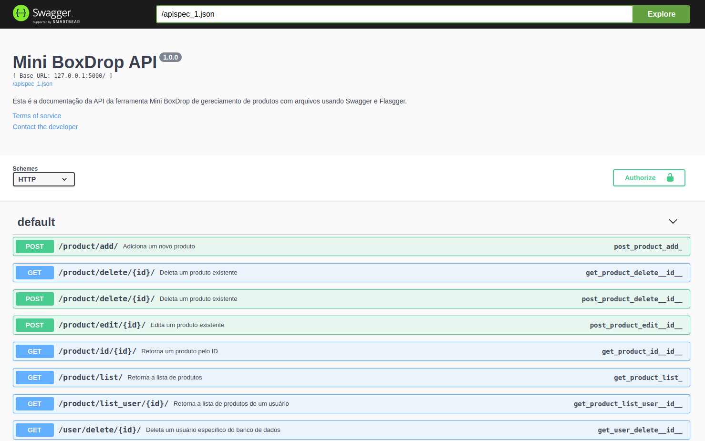

# Mini BoxDrop

Mini BoxDrop é um sistema completo que permite aos usuários gerenciar seus arquivos na nuvem. Os usuários podem fazer upload, download e gerenciar seus arquivos de forma eficiente. O sistema é dividido em duas partes principais: o backend e o frontend.

## Estrutura do Projeto

- `backend/`: Contém a aplicação backend feita em Flask, utilizando SQLite como banco de dados para gerenciar usuários e produtos.
- `frontend/`: Contém a aplicação frontend construída com HTML, CSS, JavaScript e Bootstrap.

## Descrição do Sistema

### Backend

O backend do Mini BoxDrop é responsável por gerenciar as operações de armazenamento e recuperação de dados, autenticação de usuários e outras operações relacionadas ao servidor. Ele foi desenvolvido utilizando Flask, um microframework web em Python, e utiliza SQLite como banco de dados.

#### Principais Funcionalidades do Backend:
- Autenticação de usuários (login e registro).
- Gerenciamento de produtos (upload, download, edição e exclusão de arquivos).
- API RESTful para comunicação com o frontend.

Para mais detalhes sobre a configuração e uso do backend, consulte o [README do Backend](backend/README.md).
#### Estrutura do backend

<pre><font color="#12488B"><b>.</b></font>
├── <font color="#12488B"><b>app</b></font>
│   ├── <font color="#12488B"><b>config</b></font>
│   │   ├── config.py
│   │   ├── __init__.py
│   ├── <font color="#12488B"><b>forms</b></font>
│   │   ├── forms.py
│   │   ├── __init__.py
│   ├── __init__.py
│   ├── <font color="#12488B"><b>models</b></font>
│   │   ├── __init__.py
│   │   ├── models.py
│   ├── <font color="#12488B"><b>routes</b></font>
│   │   ├── auth.py
│   │   ├── error.py
│   │   ├── home.py
│   │   ├── __init__.py
│   │   ├── product.py
│   ├── <font color="#12488B"><b>static</b></font>
│   │   └── <font color="#12488B"><b>uploads</b></font>
│   └── <font color="#12488B"><b>utils</b></font>
│       ├── helpers.py
├── <font color="#12488B"><b>assets</b></font>
│   ├── <font color="#C01C28"><b>file_ziped.zip</b></font>
│   └── libs.py
├── init_db.py
├── <font color="#12488B"><b>instance</b></font>
│   └── miniboxdrop_database_v1.db
├── LICENSE
├── PROJECT_ARCHITECTURE.md
├── README.md
├── requirements.txt
├── run.py
├── <font color="#12488B"><b>screenshots</b></font>
├── teste.py
</pre>

## Documentação da API com Swagger

O Mini BoxDrop utiliza Swagger para documentar a API, facilitando a exploração e o teste dos endpoints disponíveis.

### Acessando a Documentação do Swagger

Após iniciar o servidor backend, você pode acessar a documentação do Swagger seguindo estas etapas:

1. **Inicie o servidor backend**:
   Certifique-se de que o servidor backend está em execução. Use o seguinte comando no diretório do backend:
   ```sh
   flask run
   ```

2. **Acesse a documentação no navegador**:
   Abra o navegador web e navegue até `http://127.0.0.1:5000/apidocs/`. Aqui você encontrará a interface do Swagger que documenta todos os endpoints da API.

### Utilizando o Swagger

A interface do Swagger permite que você explore e teste os endpoints da API. Cada endpoint está documentado com os seguintes detalhes:
- **URL do endpoint**: A URL completa para acessar o endpoint.
- **Método HTTP**: O método HTTP (GET, POST, PUT, DELETE) suportado pelo endpoint.
- **Parâmetros**: Os parâmetros que o endpoint aceita, incluindo cabeçalhos, query parameters, path parameters e corpo da requisição.
- **Exemplos de Resposta**: Exemplos de respostas esperadas do endpoint, incluindo códigos de status e estrutura do JSON de resposta.

Você pode testar os endpoints diretamente na interface do Swagger. Basta selecionar o endpoint desejado, preencher os parâmetros necessários e clicar no botão "Execute".

#### Abaixo, pode-se ser observado um exemplo de um endpoint da API documentado no Swagger:  



### Frontend

O frontend do Mini BoxDrop fornece uma interface amigável para os usuários interagirem com o sistema. Ele foi desenvolvido utilizando HTML, CSS, JavaScript e Bootstrap para garantir uma experiência de usuário responsiva e moderna.

#### Principais Funcionalidades do Frontend:
- Formulário de login e registro.
- Interface para upload e download de arquivos.
- Tabela de gerenciamento de arquivos, permitindo editar e excluir arquivos.
- Notificações e feedback ao usuário sobre as operações realizadas.

Para mais detalhes sobre a configuração e uso do frontend, consulte o [README do Frontend](frontend/README.md).

## Como Começar

### Requisitos

- Python 3.x
- Flask
- SQLite
- Node.js (opcional, para gerenciamento de pacotes e ferramentas de frontend)
- Navegador web moderno

### Configuração do Backend

1. Clone o repositório:
   ```sh
   git clone https://github.com/seuusuario/miniboxdrop.git
   cd miniboxdrop/backend
   ```

2. Crie e ative um ambiente virtual:
   ```sh
   python -m venv venv
   source venv/bin/activate  # No Windows use `venv\Scripts\activate`
   ```

3. Instale as dependências:
   ```sh
   pip install -r requirements.txt
   ```

4. Configure o banco de dados:
   ```sh
      python init_db.py
   ```

5. Inicie o servidor:
   ```sh
   flask run
   ```

### Uso
Navegue até `http://127.0.0.1:5000/` em seu navegador web para ver se o servidor está funcionando corretamente.
Deve aparecer uma mensagem de de serviço ativo:
```json
{
"message": "Server is running",
"status": 200
}
```

### Configuração do Frontend

1. Navegue até a pasta do frontend:
   ```sh
   cd ../frontend
   ```

2. Abra o arquivo `index.html` no seu navegador web.

## Contribuição

Contribuições são bem-vindas! Sinta-se à vontade para abrir issues ou pull requests no GitHub.

## Licença

Este projeto está licenciado sob a Licença MIT. Consulte o arquivo LICENSE para obter mais informações.


## Features
- **Client Management**: Register, update, and delete clients.
- **Product Management**: Add, edit, and remove products.
- **User Authentication**: Secure login and registration system for users.
- **Responsive Design**: Utilizes Bootstrap to ensure a seamless experience across various devices.

## Tecnologias Utilizadas
- Python 3
- Flask
- SQLAlchemy
- SQLite
- HTML5
- CSS3
- Bootstrap